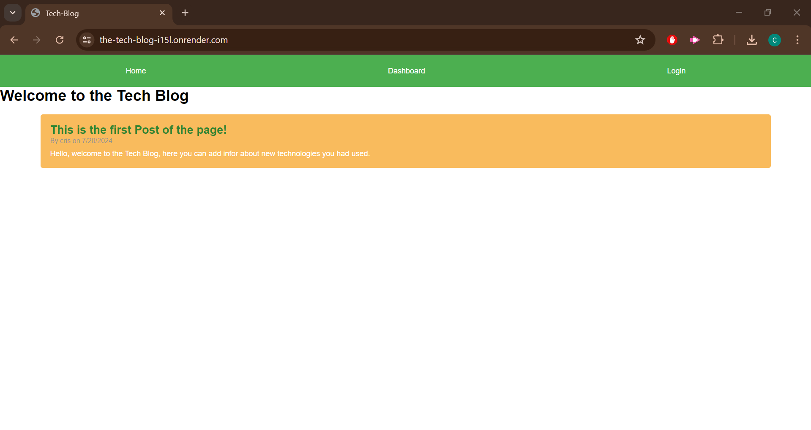
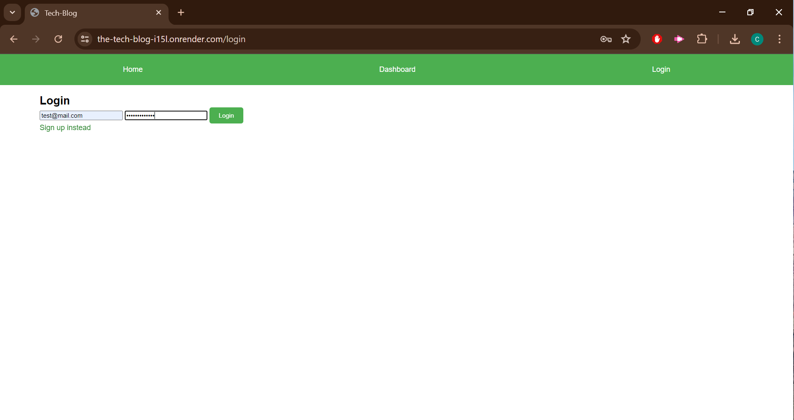
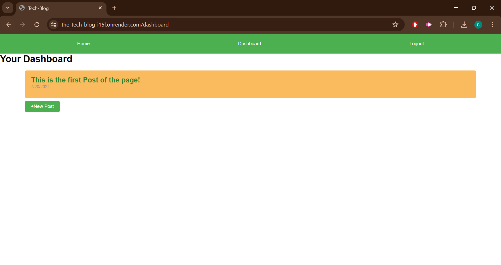
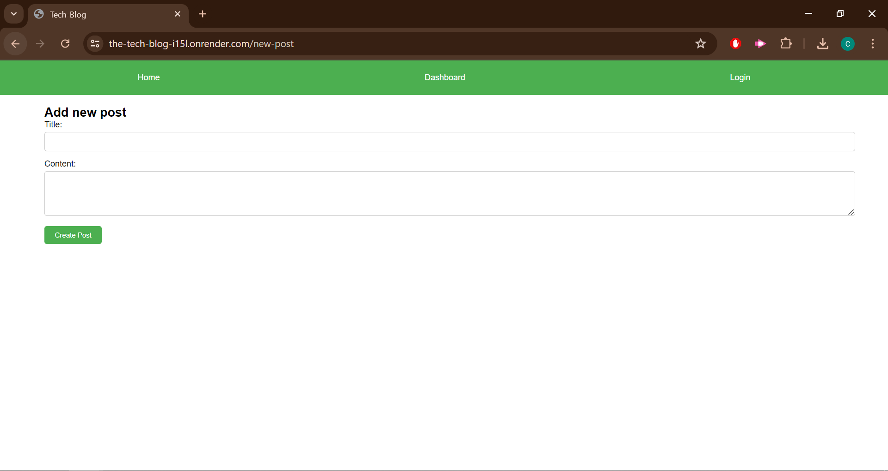
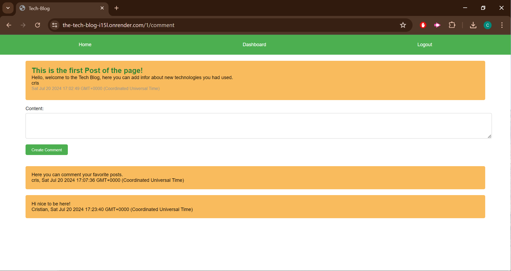

  # The Tech Blog  

  ## Description 
  As a developer I want to create a blog site, so that I can publish abput tech articles, blog posts, and my thoughts and opinions. 

  I need to sign up or log in, so I can create, update, and comment on posts, of me or other persons posts. 

  There are navigation links to the Homepage, Dashboard and Login/Logout. 

  This app is deployed in render in the following link. https://the-tech-blog-i15l.onrender.com 

  ## Table of Contents 
  - [Installation](#installation)
  - [Usage](#usage)
  - [Contributing](#contributing)
  - [License](#license)
  - [Questions](#questions)

  ## Installation 
  To run the server in PSQL, you need to download all the packages used. 
  npm install: to get all the packages.
  
  Once you install the packages, in your terminal you can run the DB, using "psql -U postgres" amd instaling the schema. 

  Then you can start the app by entering an "npm start" in your terminal.

  ## Usage
  This is your homepage
  
  
  First you need to sign up or log in to use the app.

  

  Once you logged in you can access the dashboard and comment section. Where you can create a new post or comment an existing post.

  

  

  

  ## Credits
  Cristian Loera

  ## License
  No License
  

  ## Questions
  If you have any questions about the repository, contact me in [el-bicho7](https://github.com/el-bicho7) and @ loera_73@hotmail.com
 
  